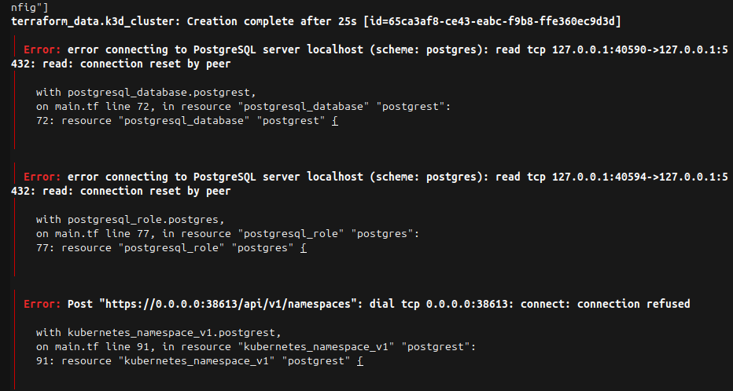
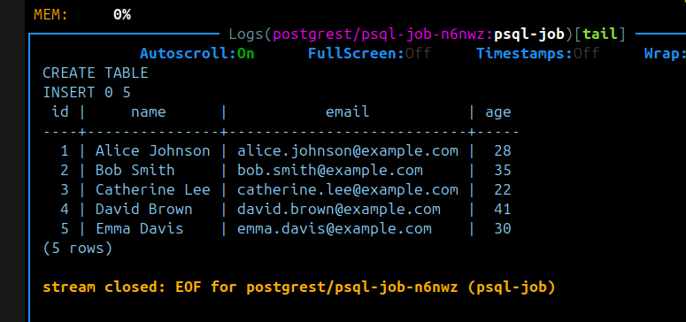
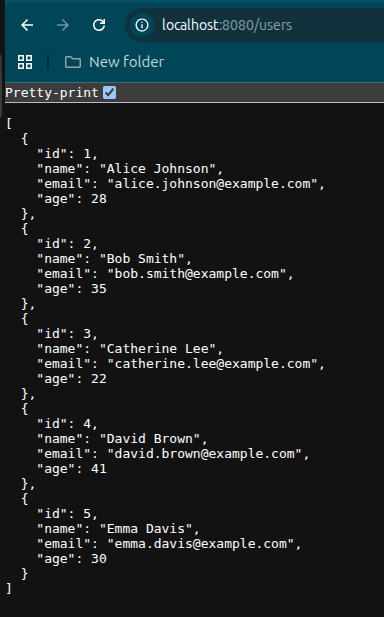
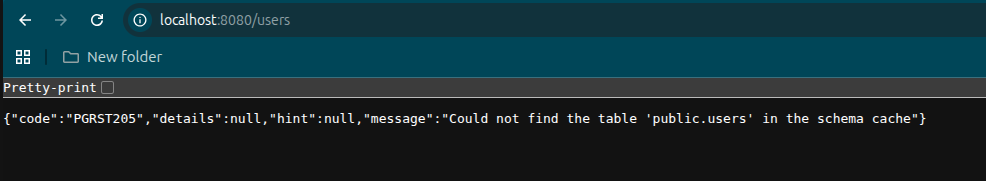

# Infrastructure Take Home

Treat this system as a production system.

## Getting Started

Clone this repository locally.
Create your own public git repository in github or somewhere we can access and push this code into it.
Make changes to your repository.
Getting things to work for you is part of the assessment.

You will be assessed by someone cloning your repository when you're finished and running your instructions to recreate the expected solution.
If we cannot run your repository instructions we cannot assess your work.

### Prerequsites

You will need the following:
* docker runtime and tools
* k3d CLI
* opentofu binary or terraform
* kubectl binary
* git

## Starting point

Use terraform or opentofu to initialise a k3d cluster and postgres instance locally from the `tofu` directory.
Install Argo CD into the k3d cluster by following the instructions in the `argocd` directory.

# Problem

Please add commits to your fork of the repo to answer this problem.
Note: the use of the word `postgrest` is confusing, but correct - this is a project that we're going to deploy.

> During initial boostrap the **first target onto k3d cluster and postgres** to initialise them first. As we are facing egg and chicken dilema, where some terraform providers require upstream services to be ready.




```sh
cd tofu
terraform apply --target='terraform_data.k3d_cluster' --target='docker_container.postgres'
terraform apply 
```

## Add a user to the database

Please add a super user to the postgrest database.

## Inject a secret for postgrest

Creating a superuser account in this new database, inject the secrets into the k3d cluster into a namespace called postgrest.
You must do this with terraform/opentofu.

## Install Postgrest into the k3d cluster

https://docs.postgrest.org/en/v14/

The result should be an accessible endpoint that you can use in your browser.

## Inject some data from the cluster using a `Job`

Use a kubernetes job to inject some data into the postgres database

## Provide an expected screenshot

Update this file, README.md, with a screenshot of what we should see when we visit the URL after following your instructions - this should show us the data you have injected.

### Kubernetes SQL injection job output

**NOTE:** Some initial failed jobs are expected due to `host.k3d.internal` DNS resolution errors

```bash
psql: error: could not translate host name "host.k3d.internal" to address: Name or service not known
```



### PostgREST API

Go to [http://localhost:8080/users]() in the browser




### Areas of improvement

- split `tofu` terraform module into
    - `k3d` - boostraps empty k3d cluster
    - `k8s-config`- manages k8s resources
    - `postgres` - boostraps empty postgres container
    - `postgres-config` - manages postgres resources

- in case of missing data in PostgREST please enable [schema cache reloading](https://docs.postgrest.org/en/v14/references/schema_cache.html#schema-cache-reloading)




## Destroy

```sh
terraform state rm kubernetes_config_map_v1.psql_job
terraform state rm kubernetes_deployment_v1.postgrest
terraform state rm kubernetes_job_v1.psql_job
terraform state rm kubernetes_namespace_v1.postgrest
terraform state rm kubernetes_secret_v1.postgrest
terraform state rm kubernetes_secret_v1.psql_job
terraform state rm kubernetes_service_v1.postgrest
terraform state rm kubernetes_ingress_v1.postgrest
terraform state rm postgresql_role.postgres

terraform destroy
```